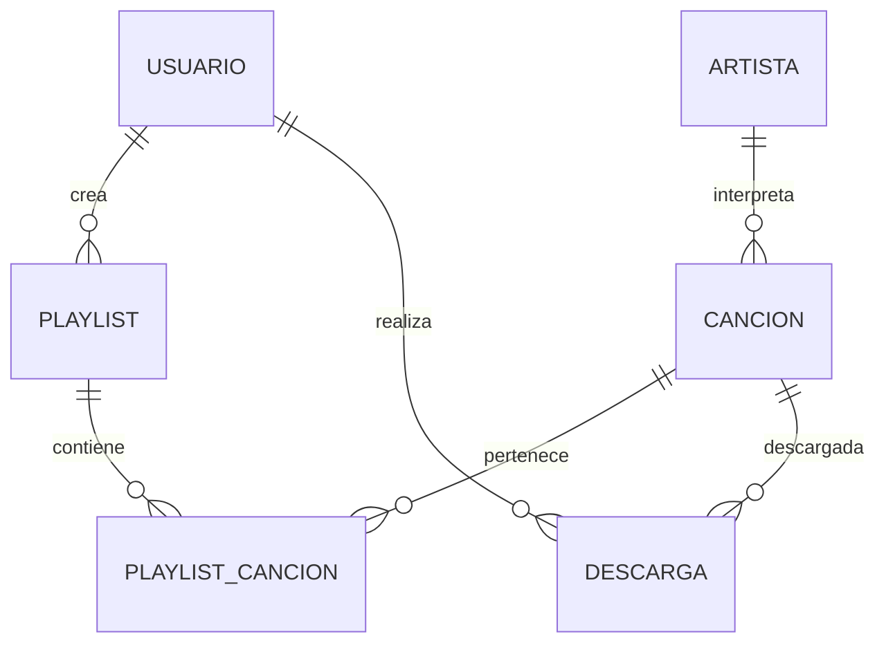

#  Diccionario de Datos - Plataforma para Reproducir y Descargar Música

---

## Proyecto
**Plataforma para reproducir y descargar música**

---

## Descripción general
La plataforma permite a los usuarios buscar música, reproducir canciones, descargar contenido y gestionar playlists desde una aplicación móvil conectada a un backend con base de datos.

---

# Tabla: USUARIO

| Campo | Tipo de Dato | Tamaño | PK | FK | Nulo | Descripción |
|------|-------------|--------|----|----|------|-------------|
| id_usuario | INT | - | Sí | No | No | Identificador único del usuario |
| nombre_usuario | VARCHAR | 50 | No | No | No | Nombre de usuario en la plataforma |
| correo | VARCHAR | 100 | No | No | No | Correo electrónico del usuario |
| contraseña | VARCHAR | 255 | No | No | No | Contraseña cifrada del usuario |
| fecha_registro | DATETIME | - | No | No | No | Fecha de creación de la cuenta |

---

# Tabla: ARTISTA

| Campo | Tipo de Dato | Tamaño | PK | FK | Nulo | Descripción |
|------|-------------|--------|----|----|------|-------------|
| id_artista | INT | - | Sí | No | No | Identificador único del artista |
| nombre_artista | VARCHAR | 100 | No | No | No | Nombre del artista o grupo musical |
| pais_origen | VARCHAR | 50 | No | No | Sí | País de origen del artista |
| genero_principal | VARCHAR | 50 | No | No | Sí | Género musical principal |

---

# Tabla: CANCION

| Campo | Tipo de Dato | Tamaño | PK | FK | Nulo | Descripción |
|------|-------------|--------|----|----|------|-------------|
| id_cancion | INT | - | Sí | No | No | Identificador único de la canción |
| titulo | VARCHAR | 150 | No | No | No | Título de la canción |
| duracion | TIME | - | No | No | No | Duración de la canción |
| genero | VARCHAR | 50 | No | No | Sí | Género musical |
| url_audio | VARCHAR | 255 | No | No | No | Ruta o enlace del archivo de audio |
| id_artista | INT | - | No | Sí | No | Artista que interpreta la canción |

---

# Tabla: PLAYLIST

| Campo | Tipo de Dato | Tamaño | PK | FK | Nulo | Descripción |
|------|-------------|--------|----|----|------|-------------|
| id_playlist | INT | - | Sí | No | No | Identificador único de la playlist |
| nombre_playlist | VARCHAR | 100 | No | No | No | Nombre de la playlist |
| fecha_creacion | DATETIME | - | No | No | No | Fecha de creación |
| id_usuario | INT | - | No | Sí | No | Usuario propietario de la playlist |

---

# Tabla: PLAYLIST_CANCION

| Campo | Tipo de Dato | Tamaño | PK | FK | Nulo | Descripción |
|------|-------------|--------|----|----|------|-------------|
| id_playlist | INT | - | Sí | Sí | No | Relación con playlist |
| id_cancion | INT | - | Sí | Sí | No | Relación con canción |
| fecha_agregado | DATETIME | - | No | No | No | Fecha en que se agregó la canción |

 **Clave primaria compuesta:** (id_playlist, id_cancion)

---

# Tabla: DESCARGA

| Campo | Tipo de Dato | Tamaño | PK | FK | Nulo | Descripción |
|------|-------------|--------|----|----|------|-------------|
| id_descarga | INT | - | Sí | No | No | Identificador único de la descarga |
| fecha_descarga | DATETIME | - | No | No | No | Fecha en que se realizó la descarga |
| id_usuario | INT | - | No | Sí | No | Usuario que realiza la descarga |
| id_cancion | INT | - | No | Sí | No | Canción descargada |

---

# Modelo Relacional

```text
USUARIO(
    id_usuario PK,
    nombre_usuario,
    correo,
    contraseña,
    fecha_registro
)

ARTISTA(
    id_artista PK,
    nombre_artista,
    pais_origen,
    genero_principal
)

CANCION(
    id_cancion PK,
    titulo,
    duracion,
    genero,
    url_audio,
    id_artista FK
)

PLAYLIST(
    id_playlist PK,
    nombre_playlist,
    fecha_creacion,
    id_usuario FK
)

PLAYLIST_CANCION(
    id_playlist PK FK,
    id_cancion PK FK,
    fecha_agregado
)

DESCARGA(
    id_descarga PK,
    fecha_descarga,
    id_usuario FK,
    id_cancion FK
)
````

---

# Relaciones entre entidades

| Entidad origen | Tipo de relación | Entidad destino |
| -------------- | ---------------- | --------------- |
| Usuario        | 1 : N            | Playlist        |
| Usuario        | 1 : N            | Descarga        |
| Artista        | 1 : N            | Canción         |
| Playlist       | N : M            | Canción         |
| Canción        | 1 : N            | Descarga        |

---

# Diagrama Entidad-Relación (MER)



---

# Conclusión

Este modelo de datos permite gestionar una plataforma de música con funcionalidades de búsqueda, reproducción, descarga y organización de playlists. La estructura garantiza integridad, escalabilidad y correcta relación entre usuarios, canciones y artistas.

```
