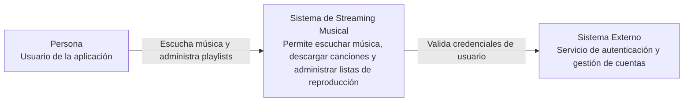
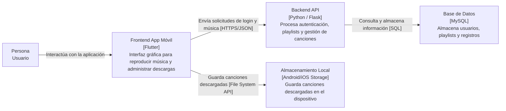

# Tarea 3 - Modelo C4

Nivel 1 — Diagrama de Contexto
## Aplicación de Streaming Musical

El siguiente documento presenta la arquitectura de una aplicación de streaming musical utilizando el Modelo C4. Se desarrollan los niveles 1 y 2 para representar el contexto general del sistema y los contenedores principales de la solución.

Nivel 2 — Diagrama de Contenedores

Caja rota (fallo de la BD)
Si la base de datos pierde conexión durante 10 minutos, el Backend API no podrá consultar usuarios ni playlists. El Frontend seguirá funcionando parcialmente, permitiendo al usuario navegar por la aplicación y reproducir canciones descargadas localmente.

El usuario será informado mediante mensajes visuales indicando que el servicio se encuentra temporalmente fuera de línea.

Como estrategia de tolerancia a fallos, el sistema implementará manejo de excepciones, reintentos automáticos de conexión y almacenamiento temporal en caché para evitar el colapso total de la aplicación.

Diccionario de contenedores
| Contenedor | Tecnología | Responsabilidad Principal | Despliegue Local |
|---|---|---|---|
| Frontend App Móvil | Flutter | Mostrar interfaz y reproducir música | Emulador Android/iOS |
| Backend API | Python / Flask | Procesar lógica de negocio y autenticación | localhost:5000 |
| Base de Datos | MySQL | Almacenar usuarios y playlists | Puerto 3306 |
| Almacenamiento Local | Android/iOS Storage | Guardar canciones descargadas | Memoria del dispositivo |
